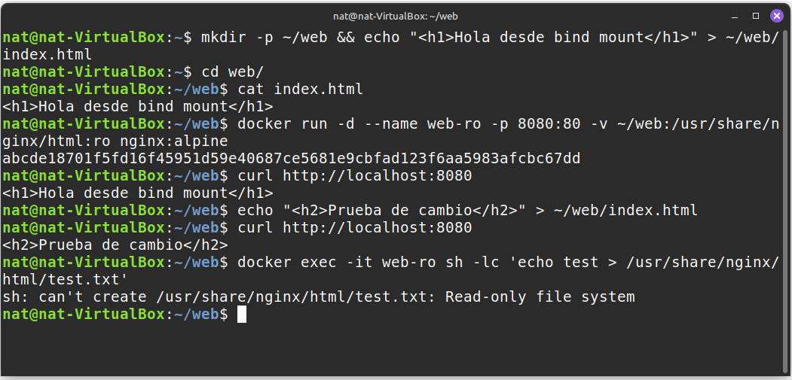
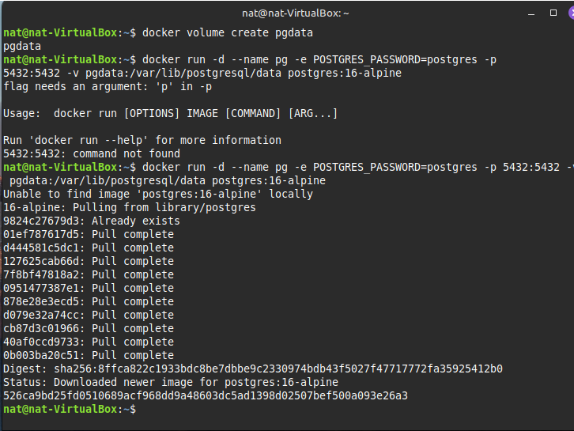
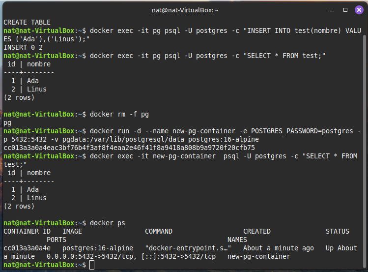
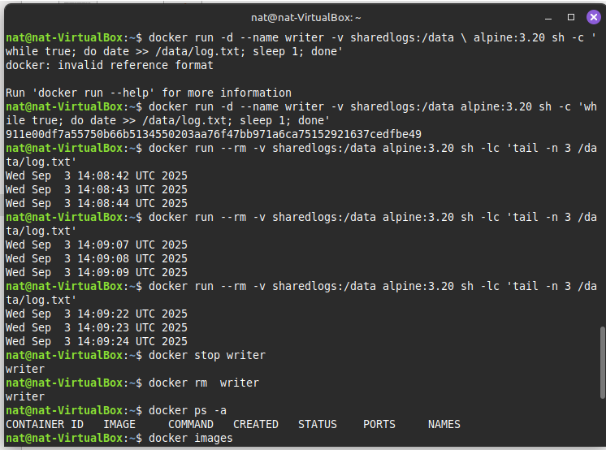
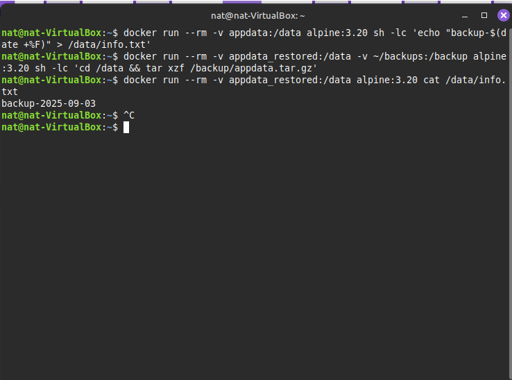

# Taller de Repaso Volumenes

## Ejercicio-1: Bind mount en modo lectura con Nginx

### Comandos usados:

mkdir -p ~/web && echo "<h1>Hola desde bind mount</h1>" > ~/web/index.html
cd web/
cat index.html
docker run -d --name web-ro -p 8080:80 -v ~/web:/usr/share/nginx/html:ro nginx:alpine
curl http://localhost:8080
echo "<h2>Prueba de cambio</h2>" > ~/web/index.html
curl http://localhost:8080
docker exec -it web-ro sh -lc 'echo test > /usr/share/nginx/html/test.txt'

### Evidencia:

### Reflexión:

En este ejercicio repase algunos comandos basicos de linux como cat y echo, aprendí de la existencia de :ro para controlar los permisos del volumen, en este caso solo de lectura y el uso de sh -lc para ejecutar en el contenedor el comando que sigue luego, en este ejercicio no tuve ningún problema

## Ejercicio-2: Named volume con PostgreSQL

### Comandos usados:

docker volume create pgdata
docker run -d --name pg -e POSTGRES_PASSWORD=postgres -p 5432:5432 -v pgdata:/var/lib/postgresql/data postgres:16-alpine
docker exec -it pg psql -U postgres -c "CREATE TABLE test(id serial, nombre text);"
docker exec -it pg psql -U postgres -c "INSERT INTO test(nombre) VALUES ('Ada'),('Linus');"
docker exec -it pg psql -U postgres -c "SELECT \* FROM test;"
docker run -d --name new-pg-container -e POSTGRES_PASSWORD=postgres -p 5432:5432 -v pgdata:/var/lib/postgresql/data postgres:16-alpine
docker exec -it new-pg-container psql -U postgres -c "SELECT \* FROM test;"

### Evidencia:

### Reflexión:

En este ejercicio aprendí otra manera de configura las credenciales de postgre en este caso, asi como psql: para jecutar comandos como cliente de PostgreSQL. En este ejercicio no tuve ningun problema

## Ejercicio 2: Volumen compartido entre dos contenedores

### Comandos usados:

docker volume create sharedlogs
docker run -d --name writer -v sharedlogs:/data alpine:3.20 sh -c 'while true; do date >> /data/log.txt; sleep 1; done'
docker run -it --rm --name reader -v sharedlogs:/data alpine:3.20 tail -f /data/log.txt
docker stop reader
docker run -it --rm --init --name reader -v sharedlogs:/data alpine:3.20 tail -f /data/log.txt
docker rm -f writer
docker run -d --name writer -v sharedlogs:/data alpine:3.20 sh -c 'while true; do date >> /data/log.txt; sleep 1; done'
docker run --rm -v sharedlogs:/data alpine:3.20 sh -lc 'tail -n 3 /data/log.txt'
docker run --rm -v sharedlogs:/data alpine:3.20 sh -lc 'tail -n 3 /data/log.txt'
docker run --rm -v sharedlogs:/data alpine:3.20 sh -lc 'tail -n 3 /data/log.txt'
docker stop writer
docker rm writer

### Evidencia:

### Reflexión:

En este ejercicio probé tener un contenedor consumidor y otro productor que consumian un mismo recurso en esta caso el volumen creado, en este caso si tuve un problema la primera vez que ejecuté el reader pues no lo pude detener con Ctrl+C, tuve que abrir otra terminal y detener ese contenedor y para volver a ejecutarlo le agregué --init que es un comando de Docker que maneja las señales.

## Ejercicio 4: Backup y restauración de un volumen

docker volume create appdata
docker run --rm -v appdata:/data alpine:3.20 sh -lc 'echo "backup-$(date +%F)" > data/info.txt'                           
mkdir -p ~/backups
docker run --rm -v appdata:/data:ro -v ~/backups:/backup alpine:3.20 sh -lc 'cd /data && tar czf /backup/appdata.tar.gz .'
docker volume create appdata_restored 
docker run --rm -v appdata_restored:/data -v ~/backups:/backup alpine:3.20 sh -lc 'cd /data & tar xzf /backup/appdata.tar.gz'
docker run --rm -v appdata_restored:/data alpine:3.20 cat /data/info.txt
docker run --rm -v appdata:/data alpine:3.20 sh -lc 'echo "backup-$(date +%F)" > /data/info.txt'
docker run --rm -v appdata_restored:/data -v ~/backups:/backup alpine:3.20 sh -lc 'cd /data && tar xzf /backup/appdata.tar.gz'
docker run --rm -v appdata_restored:/data alpine:3.20 cat /data/info.txt

### Evidencia:

### Reflexión

En este ejercicio repasé el comando tar para comprimir acrhivos, en este caso si tubve más dificultad pues tuve 2 errores, primero porque que info.txt se creó en la carpeta actual del contenedor (root: /), no en /data y luego tuve un error de sintaxis pues faltó un &, tuve que volver a ejecutar los comandos corregidos y luego el tar sí se ejecutó en /data y descomprimió el backup en appdata_restored
